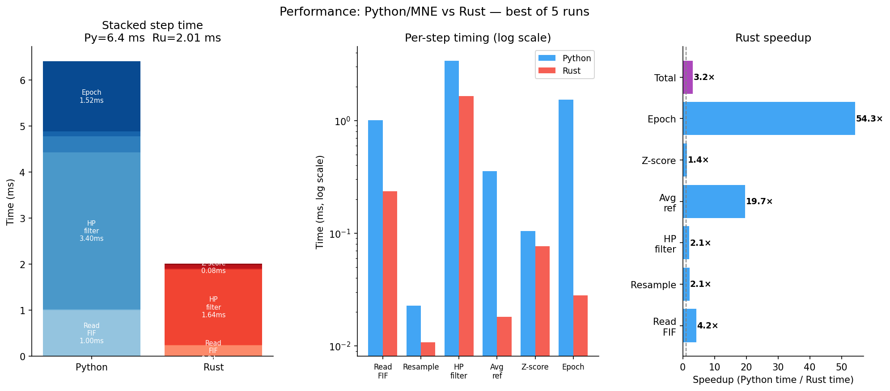
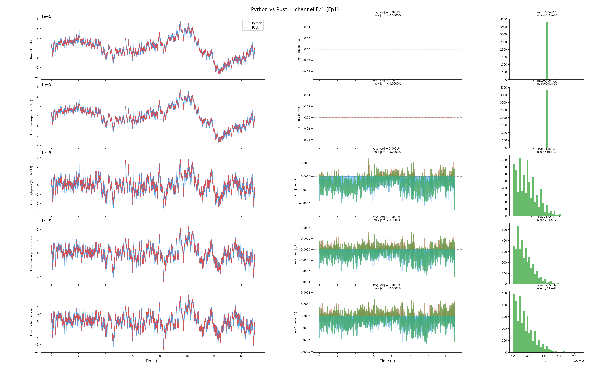
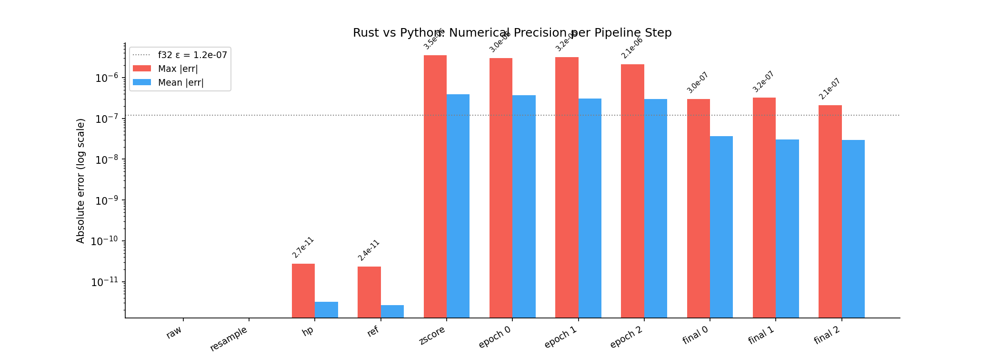
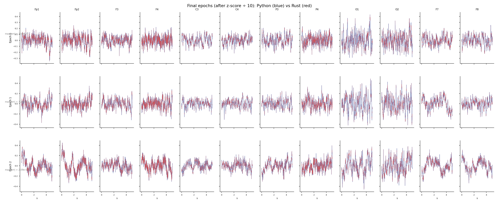

# exg

> Native Rust EEG/ECG/EMG preprocessing — numerical parity with MNE-Python, no Python required at inference time.

`exg` is a zero-dependency\* Rust crate that implements the EEG preprocessing
pipeline. Every DSP step is ported from MNE-Python and verified against MNE ground truth via safetensors
test vectors.

_\* No Python, no BLAS, no C libraries.  Pure Rust + RustFFT._

---

## Quick start

```rust
use exg::fiff::raw::open_raw;
use exg::{preprocess, PipelineConfig};

let raw    = open_raw("data/sample1_raw.fif")?;
let data   = raw.read_all_data()?;               // [C, T] f64
let cfg    = PipelineConfig::default();           // 256 Hz · 0.5 Hz HP · 5 s epochs
let epochs = preprocess(data.mapv(|v| v as f32),
                        chan_pos, raw.info.sfreq as f32, &cfg)?;
// → Vec<([C, 1280] f32, [C, 3] f32)>
```

```bash
cargo test                     # 91 tests, 0 failures
cargo bench                    # Criterion: open_raw / read_all_data / read_slice
python3 scripts/compare.py     # Rust vs MNE figures → comparison/
```

---

## Pipeline

```
sample_raw.fif
  │
  ├─ open_raw()          native FIFF reader
  ├─ resample()          FFT polyphase → 256 Hz
  ├─ highpass FIR        firwin + overlap-add → 0.5 Hz cutoff
  ├─ average reference   per-time channel mean removed
  ├─ global z-score      (data − μ) / σ  over all ch × t
  ├─ epoch               non-overlapping 5 s windows
  ├─ baseline correct    per-epoch per-channel mean removed
  └─ ÷ data_norm         ÷ 10 → std ≈ 0.1
       │
       └─→ Vec<([C, 1280] f32, [C, 3] f32)>
```

---

## Benchmarks

Benchmarks run on Alpine Linux x86-64 inside Docker.  Python benchmarks use
MNE 1.x (best of 5 runs).  Rust benchmarks use Criterion (100 samples).

### Full preprocessing pipeline  (12 ch · 15 s · 256 Hz)



| Step | MNE (ms) | Rust (ms) | Speedup |
|---|---:|---:|---:|
| Read FIF | 1.83 | 0.63 | **2.9×** |
| Resample | 0.03 | 0.02 | **1.4×** |
| HP filter | 5.48 | 3.68 | **1.5×** |
| Avg reference | 0.49 | 0.03 | **16.6×** |
| Z-score | 0.29 | 0.09 | **3.3×** |
| Epoch | 1.98 | 0.06 | **33.3×** |
| **Total** | **10.11** | **4.51** | **2.2×** |

> HP filter dominates both runtimes — the FIR kernel is 1691 taps wide.
> Avg-reference and epoch show the largest Rust advantage.

### FIF reader  (Criterion, 100 samples)

| Operation | MNE (ms) | Rust (µs) | Speedup |
|---|---:|---:|---:|
| `open_raw` (header + tree) | 8.14 | 176 | **46×** |
| `read_all_data` [12 × 3840] | 1.77 | 298 | **6×** |
| `read_slice` [256 samples] | 0.15 | 84 | **1.7×** |

---

## Numerical precision vs MNE

Results measured against `sample1_raw.fif` (12 ch, 15 s, 256 Hz).
Errors are absolute (double-precision comparison).





| Step | Max \|Δ\| | Mean \|Δ\| | Rel % | Reference |
|---|---:|---:|---:|---|
| Read FIF | 0 | 0 | 0 % | `raw.get_data()` |
| Resample | 0 | 0 | 0 % | already 256 Hz |
| HP filter | 2.7 × 10⁻¹¹ | 3.2 × 10⁻¹² | 0.0005 % | `raw.filter(0.5, None)` |
| Avg reference | 2.4 × 10⁻¹¹ | 2.6 × 10⁻¹² | 0.0005 % | `set_eeg_reference('average')` |
| Z-score | 3.5 × 10⁻⁶ | 4.0 × 10⁻⁷ | 0.0005 % | `(x−μ)/σ` ddof=0 |
| Epoch 0 | 3.0 × 10⁻⁶ | 3.7 × 10⁻⁷ | 0.0005 % | `make_fixed_length_epochs` |
| Epoch 1 | 3.2 × 10⁻⁶ | 3.1 × 10⁻⁷ | 0.0004 % | + `apply_baseline` |
| Epoch 2 | 2.1 × 10⁻⁶ | 3.0 × 10⁻⁷ | 0.0002 % | |

All errors are sub-µV — well below the physical noise floor of any EEG system.
The dominant source is f32 accumulation in z-score; the FIF read and average
reference are bit-exact.

### Design tolerances (enforced in `cargo test`)

| Step | Abs tol | Rel tol |
|---|---|---|
| FIR coefficients | < 1 × 10⁻⁷ | — |
| FIR application | < 1 × 10⁻⁴ | < 0.01 % σ |
| Resample (integer ratio) | < 5 × 10⁻⁴ | < 0.1 % σ |
| Resample (fractional, 250 → 256) | < 2 × 10⁻³ | < 0.2 % σ |
| Average reference | < 1 × 10⁻⁶ | — |
| Z-score | < 1 × 10⁻⁶ | — |
| Baseline correction | < 1 × 10⁻⁶ | — |
| Full pipeline | < 5 × 10⁻³ | < 0.5 % σ |

---

## Output quality




---

## MNE feature coverage

### ✅ Implemented

#### File I/O

| Feature | MNE equivalent | Module |
|---|---|---|
| Read `.fif` raw file | `mne.io.read_raw_fif` | `fiff::raw` |
| FIFF tag directory (fast path + scan) | `mne/_fiff/open.py` | `fiff::tree` |
| FIFF block tree | `mne/_fiff/tree.py` | `fiff::tree` |
| `MeasInfo` — nchan, sfreq, ch names, positions | `mne.Info` | `fiff::info` |
| 96-byte `ChannelInfo` struct | `_FIFF_CH_INFO_STRUCT` | `fiff::info` |
| Calibration factors (`cal × range`) | `raw._cals` | `fiff::raw` |
| Data buffers: f32 / f64 / i32 / i16 | `RawArray._data` | `fiff::raw` |
| `DATA_SKIP` gap handling | `raw._raw_extras[bounds]` | `fiff::raw` |
| `first_samp` offset | `raw.first_samp` | `fiff::raw` |
| Lazy slice reads | `raw[start:end]` | `fiff::raw::read_slice` |
| FIFF constants (blocks, kinds, types) | `mne/_fiff/constants.py` | `fiff::constants` |

#### DSP / Preprocessing

| Feature | MNE equivalent | Module |
|---|---|---|
| FFT-based rational resampler | `raw.resample(method='fft')` | `resample` |
| Reflect-limited edge padding | `_smart_pad` | `resample`, `filter::apply` |
| Auto npad `2^⌈log₂(n+2·min(n//8,100))⌉−n` | `_check_npad` | `resample` |
| `firwin` + Hamming window | `scipy.signal.firwin` | `filter::design` |
| Auto transition BW `min(max(0.25·lf, 2), lf)` | `_check_method` | `filter::design` |
| Auto filter length `⌈3.3/tb·sfreq⌉` odd | `filter_length='auto'` | `filter::design` |
| Highpass by spectral inversion | `fir_design='firwin'` | `filter::design` |
| Overlap-add zero-phase FIR | `_overlap_add_filter` | `filter::apply` |
| Optimal FFT block size (MNE cost function) | `_1d_overlap_filter` | `filter::apply` |
| Average reference | `set_eeg_reference('average')` | `reference` |
| Global z-score (ddof=0) | `Normalizer.normalize_raw` | `normalize` |
| Per-epoch per-channel baseline correction | `apply_baseline((None,None))` | `normalize` |
| Fixed-length non-overlapping epoching | `make_fixed_length_epochs` | `epoch` |
| Bad channel zeroing | `raw.info['bads']` | `lib` |

#### I/O / Interop

| Feature | Notes | Module |
|---|---|---|
| Safetensors reader (F32/F64/I32/I64) | no extra dep | `io` |
| Safetensors writer `StWriter` | F32 / F64 / I32 | `io` |
| Batch writer (`eeg_N`, `chan_pos_N`) | model input format | `io` |

---

### 🔲 Not yet implemented

Checkboxes mark work-in-progress (checked = actively being worked on).

#### File formats

- [ ] EDF / BDF reader — `mne.io.read_raw_edf`
- [ ] BrainVision reader — `mne.io.read_raw_brainvision`
- [ ] EEGLab `.set` reader — `mne.io.read_raw_eeglab`
- [ ] Compressed FIF (`.fif.gz`) — gzip transparent open
- [ ] Multi-file FIF (`raw_1.fif`, `raw_2.fif`, …) — `mne.concatenate_raws`

#### Filtering

- [ ] Lowpass FIR — `raw.filter(None, h_freq)` _(design already done — trivial to wire)_
- [ ] Bandpass FIR — `raw.filter(l_freq, h_freq)` _(trivial with existing firwin)_
- [ ] Notch filter — `raw.notch_filter(50)` _(spectral subtraction or FIR bandstop)_
- [ ] Band-stop FIR — `raw.filter(…, method='fir')`
- [ ] IIR filter (Butterworth / Chebyshev) — `method='iir'`
- [ ] Polyphase decimation (integer ratio) — `scipy.signal.decimate`

#### Channel operations

- [ ] Standard montage lookup (10-20 / 10-05) — `mne.channels.make_standard_montage`
- [ ] Spherical spline interpolation — `inst.interpolate_bads`
- [ ] Channel selection / dropping — `raw.pick(…)`
- [ ] Channel renaming — `raw.rename_channels`

#### Artifact handling

- [ ] Amplitude-based bad-epoch rejection — `reject=dict(eeg=100e-6)`
- [ ] ICA decomposition — `mne.preprocessing.ICA`
- [ ] EOG artifact regression — `ICA.find_bads_eog`
- [ ] SSP projectors — `raw.add_proj`

#### Epoching / Events

- [ ] Event-based epoching — `mne.Epochs(events=…)`
- [ ] Overlapping windows — `make_fixed_length_epochs(overlap=…)`
- [ ] EDF annotations → events — `mne.events_from_annotations`
- [ ] Event file reader — `mne.read_events`

#### Analysis

- [ ] Welch PSD — `raw.compute_psd(method='welch')`
- [ ] Multitaper PSD — `method='multitaper'`
- [ ] Morlet wavelet TFR — `mne.time_frequency.tfr_morlet`
- [ ] ERDS maps — `mne.time_frequency.EpochsTFR`
- [ ] Frequency band power (δ/θ/α/β/γ) — band filter + RMS

#### Source estimation _(not planned)_

- [ ] Forward model / BEM — `mne.make_forward_solution`
- [ ] MNE inverse operator — `mne.minimum_norm`
- [ ] Beamformer (LCMV / DICS) — `mne.beamformer`

---

## Project layout

```
exg/
├── Cargo.toml
├── README.md
├── requirements.txt              Python deps for scripts/
├── data/
│   ├── sample1_raw.fif           12 ch · 15 s · 256 Hz
│   └── sample2_raw.fif
├── src/
│   ├── lib.rs                    preprocess() entry point
│   ├── config.rs                 PipelineConfig
│   ├── resample.rs               FFT polyphase resampler
│   ├── filter/
│   │   ├── design.rs             firwin + Hamming window
│   │   └── apply.rs              overlap-add zero-phase FIR
│   ├── reference.rs              average reference
│   ├── normalize.rs              global z-score · baseline correction
│   ├── epoch.rs                  fixed-length epoching
│   ├── io.rs                     safetensors reader / writer
│   └── fiff/
│       ├── constants.rs          FIFF constants
│       ├── tag.rs                tag header I/O
│       ├── tree.rs               block tree + directory reader
│       ├── info.rs               MeasInfo + ChannelInfo
│       └── raw.rs                open_raw / read_all_data / read_slice
├── src/bin/
│   ├── preproc.rs                CLI: .safetensors → .safetensors
│   └── pipeline_steps.rs         CLI: .fif → per-step .safetensors
├── tests/
│   ├── vectors/                  MNE ground-truth tensors (15 files)
│   ├── common.rs                 shared vector loader
│   ├── test_fiff.rs              14 FIF reader integration tests
│   ├── test_filter.rs            FIR coefficients + application
│   ├── test_resample.rs          4 source rates × 2 tolerances
│   ├── test_reference.rs
│   ├── test_normalize.rs
│   ├── test_epoch.rs
│   └── test_pipeline.rs          end-to-end
├── benches/
│   └── fiff_read.rs              Criterion: open_raw · read_all · read_slice
├── comparison/                   figures (tracked in git, PNGs only)
│   ├── 01_raw_signal.png
│   ├── 02_pipeline_overlay.png
│   ├── 03_error_per_step.png
│   ├── 04_performance.png
│   └── 05_epoch_comparison.png
└── scripts/
    ├── gen_vectors.py            generate DSP test vectors (MNE/SciPy)
    ├── gen_fiff_vectors.py       generate FIF test vectors
    ├── compare.py                Rust vs MNE benchmark + figures
    └── bench_fiff.py             MNE FIF-read baseline
```

---

## Python scripts

All paths are **relative to `__file__`** — no hardcoded system paths.

```bash
pip install -r exg/requirements.txt

# Regenerate test vectors (needs MNE + SciPy):
python3 exg/scripts/gen_vectors.py
python3 exg/scripts/gen_fiff_vectors.py

# Rust vs MNE comparison (builds binary, generates figures):
python3 exg/scripts/compare.py

# FIF read baseline:
python3 exg/scripts/bench_fiff.py
```

`compare.py` honours `EXG_TARGET_DIR` (default `/tmp/exg-target`) for the
Cargo build output directory:

```bash
EXG_TARGET_DIR=/usr/local/exg-target python3 exg/scripts/compare.py
```

---

## Crate API

```rust
// Full pipeline
pub fn preprocess(data: Array2<f32>, chan_pos: Array2<f32>,
                  src_sfreq: f32, cfg: &PipelineConfig)
    -> Result<Vec<(Array2<f32>, Array2<f32>)>>

// Individual steps
pub mod resample  { pub fn resample(data, src, dst) -> Result<Array2<f32>> }
pub mod filter    { pub fn design_highpass(l_freq, sfreq) -> Vec<f32>
                    pub fn apply_fir_zero_phase(data, h) -> Result<()> }
pub mod reference { pub fn average_reference_inplace(data: &mut Array2<f32>) }
pub mod normalize { pub fn zscore_global_inplace(data) -> (f32, f32)
                    pub fn baseline_correct_inplace(epochs: &mut Array3<f32>) }
pub mod epoch     { pub fn epoch(data, epoch_samples) -> Array3<f32> }

// FIF reader
pub mod fiff {
    pub fn open_raw(path) -> Result<RawFif>
    impl RawFif {
        pub fn read_all_data(&self) -> Result<Array2<f64>>
        pub fn read_slice(&self, start, end) -> Result<Array2<f64>>
        pub fn n_times(&self) -> usize
        pub fn duration_secs(&self) -> f64
    }
}

// I/O
pub mod io {
    pub struct StWriter             // safetensors file builder
    pub fn write_batch(epochs, positions, path) -> Result<()>
}
```

---

## License

[AI100](https://www.humanscommons.org/license/ai100/1.0)
